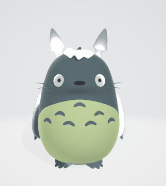
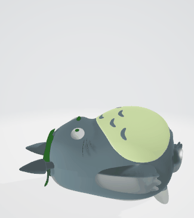
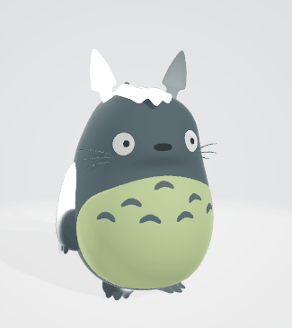

# Totoro Scene Recreation

## Description
This is a recreation for the scene in the animated film My Neighbor Totoro where totoro and the children dance around acorns and grow them into trees. It is a relatively simple scene and so does the plot in the movie at the first glance. Taking into considerations the stories behind the film creation, this scene is impactful as it turns the symbol of death into rebirth. Personally, I'm touched by the tree growing scene and the same time feeling empowered by the message of hope, love, peace, and joy. Thus the goal for this project is to recreate the scene and hopefully pass along some heart-warming messages.

## Demo

## Technology
- skinning animation
- animation blending
- camera path
- blender
  - character rigging
  - animation creation
  - texture painting

## Animated Models

  
